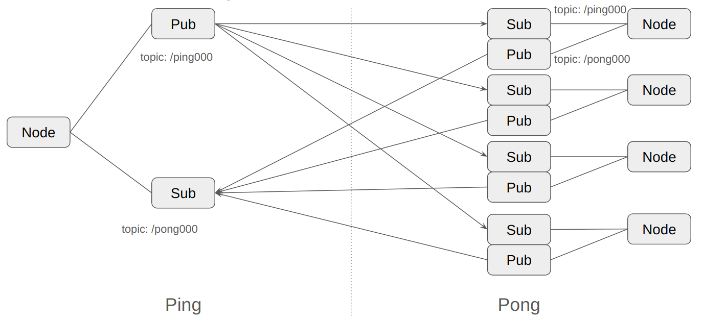
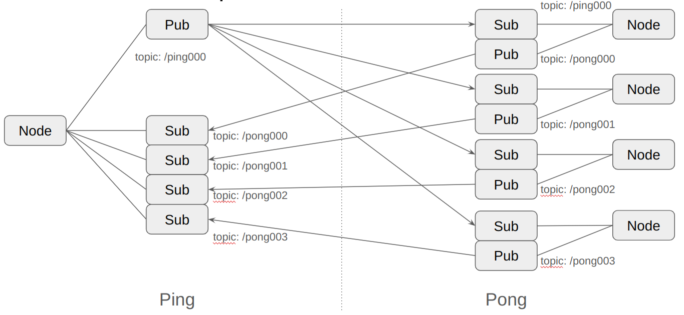
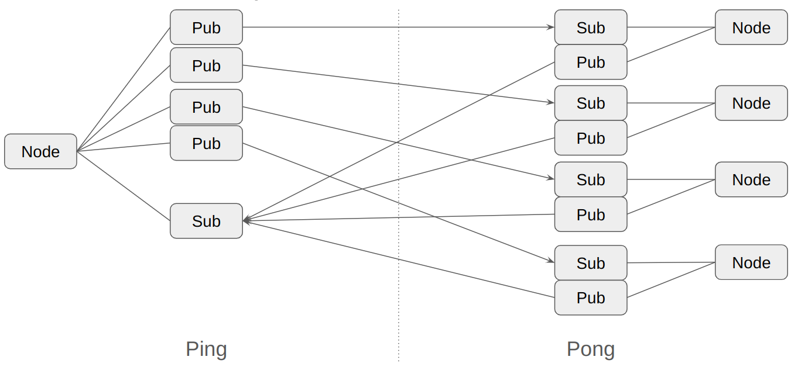
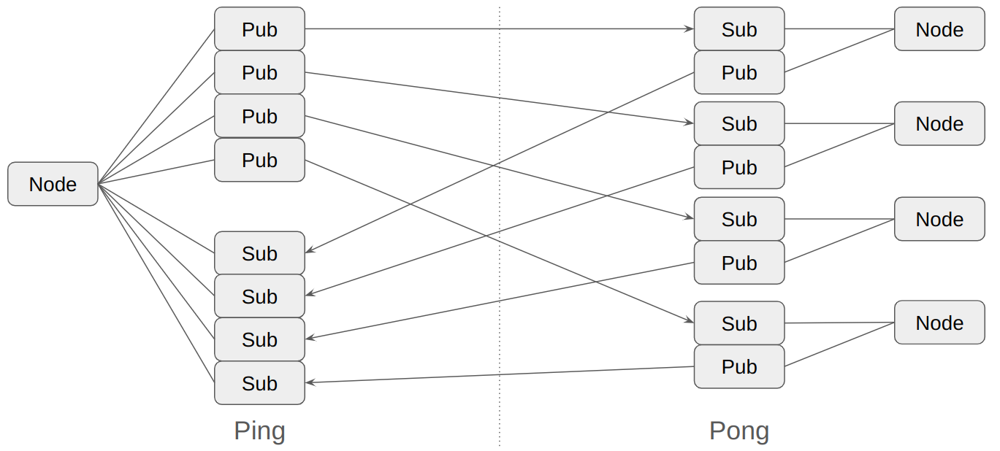

# ping_pong_measurer_ros2

## Prerequisites

Setup two Raspberry Pi 4 as ping/pong targets by using https://github.com/b5g-ex/setup_ping_pong_pi.

Follow the [README.md](https://github.com/b5g-ex/setup_ping_pong_pi/blob/main/README.md) to setup.

## How to measure

### On Pong target

1. start pong node by `make run_pong` under `ros2_ws` directory.
2. confirm all node starts up by following command which returns node counts.  
   `$ ros2 node list | grep pong | wc -l`  
   this is necessary because starting nodes takes a time.

### On Ping target

1. start ping node by `make run_ping` under `ros2_ws` directory.
2. confirm all node starts up by following command which returns node counts.  
   `$ ros2 node list | grep pong | wc -l`  
   this is necessary because starting nodes takes a time.
3. start starter node by `make run_starter` under `ros2_ws` directory.  
   starter triggers measurement.  
   data is stored under `ros2_ws/data/`

### changeable parameters

We can change following parameters by modifying Makefile,

- --pong-node-count
  - we need to change both ping and pong node count **SAME**.
- --ping-pub & --ping-sub
  - 'single' or 'multiple'
- --payload-bytes
- --measurement-times
- --enable-os-info-measuring
  - If you specify this option, os-info is measured but RTT is not measured.

### about 'single' or 'multiple'

--ping-pub single --ping-sub single

--ping-pub single --ping-sub multiple

--ping-pub multiple --ping-sub single

--ping-pub multiple --ping-sub multiple

